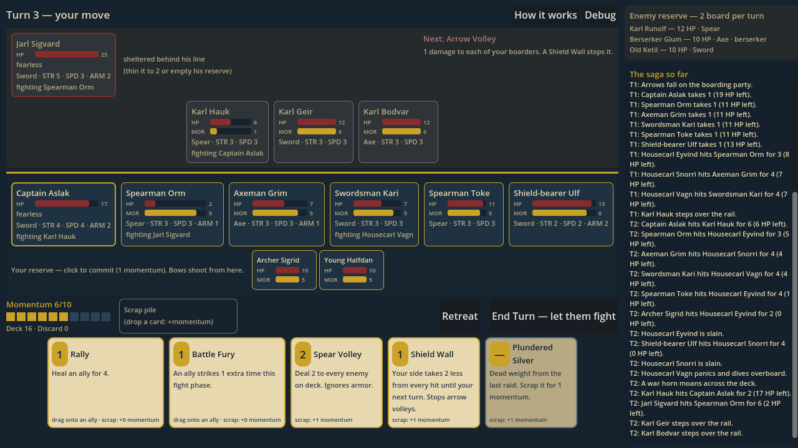
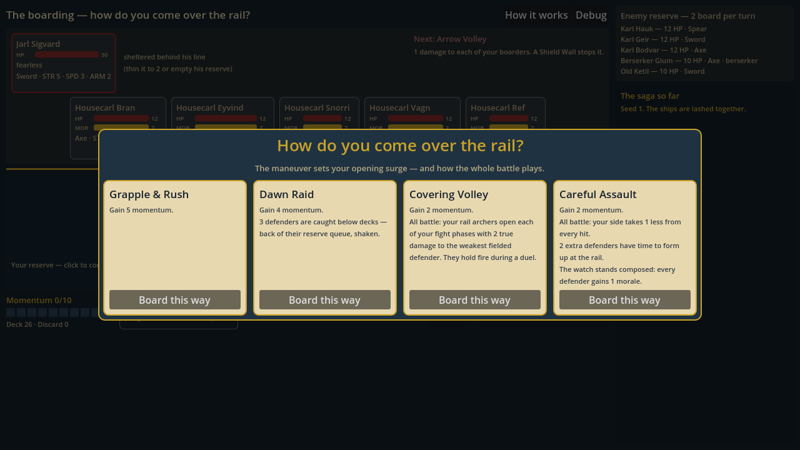
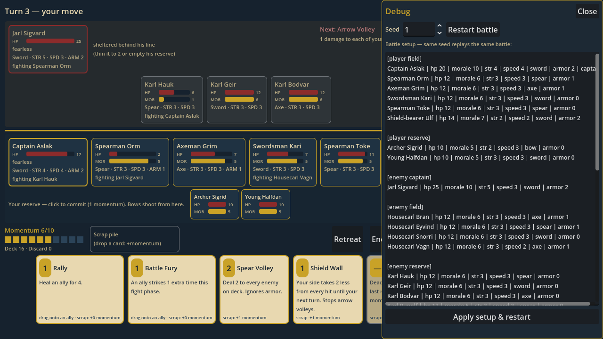

# Viking Game (working title: *Sons of the North*)

A roguelite card-driven tactics game about viking boarding actions, built in
Godot 4. Your crew storms an enemy ship; you play cards from your hand —
powered by battle **momentum** — to direct the fight; the goal is to **kill
the enemy captain**. Characters are permanently lost if they fall, and if
*your* captain dies, the run ends.

This is also an **AI-assisted development portfolio project**: the point is a
well-architected, well-tested combat engine with a clean repo history, not a
shipped game. The long-term design (raids, loot-as-dead-weight, settlement,
three playable generations, historical conquest meta) exists as the frame the
combat engine is built to fit into.

## Planning documents

| Doc | Contents |
| --- | --- |
| [docs/combat-design.md](docs/combat-design.md) | **The core.** Boarding actions: momentum, cards, permadeath, reinforcements, tuning numbers |
| [docs/roadmap.md](docs/roadmap.md) | Combat-first milestones M0–M2, optional outer layers, portfolio notes |
| [docs/game-design.md](docs/game-design.md) | The long-term frame: raid loop, loot/cargo, dynasty, city, meta progression |
| [docs/tech-plan.md](docs/tech-plan.md) | Engine choice (Godot 4), data-driven architecture, art strategy for non-artists |

## Status

**M0 (headless combat core) is built.** The full boarding-action ruleset —
momentum, morale and routs, deterministic targeting, captain exposure, cards,
the death-cancel reaction — runs as pure GDScript logic with no UI, covered
by 160+ unit checks and a battle-simulation harness. At the v0 tuning numbers,
the no-card baseline loses ~64% of fights while a random card-player wins
~89% — cards are the margin of victory, as designed.

**M1 (playable combat UI) is built.** A full boarding fight is playable with
the mouse: drag cards onto fighters (or the scrap pile), click reserves over
the rail, watch the fight phase resolve blow by blow, and read the enemy's
next tactic before committing. The engine stayed headless — the UI is a
controller that the rules engine politely waits on. A debug drawer restarts
any battle from a seed and lets you edit the whole setup (rosters, deck,
enemy tactics) as plain text.

Every battle now opens with the boarding-maneuver choice: four strategies for
coming over the rail, each reshaping the whole fight, picked from a modal
screen with the enemy line visible behind it.







Next: **M2**, the fun pass — more cards, enemy variety, and tuning against
real playtests.

## Running it

Requires [Godot 4.5](https://godotengine.org/download) (the standard editor
download works; everything except the game itself runs headless).

```sh
godot                                 # play: a full boarding action, mouse only
scripts/test.sh                       # unit tests (tests/)
scripts/sim.sh                        # 200 battles, random card-playing bot
scripts/sim.sh --bot=none --n=1000    # the no-card baseline
scripts/sim.sh --n=1 --verbose        # print one battle's turn-by-turn log
scripts/ui_smoke.sh                   # boot the UI under xvfb and play it by synthetic mouse
```

## Layout

```
src/core/    the rules engine — pure logic, no UI, deterministic per seed
src/sim/     bots and the headless balance harness
src/ui/      the battle table: tokens, cards, HUD, debug drawer (no rules here)
tests/       unit tests + minimal runner (godot --headless -s tests/run_tests.gd)
docs/        design documents + screenshots
```
